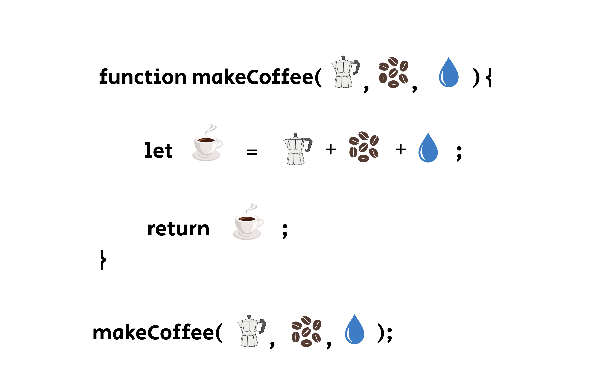
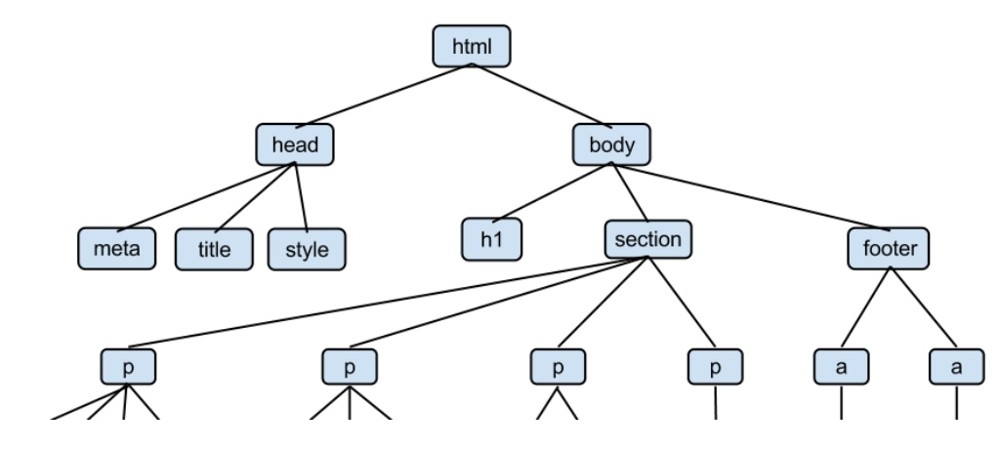
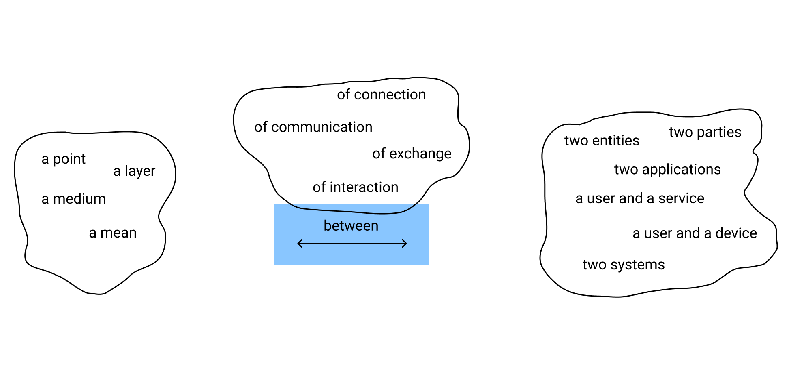
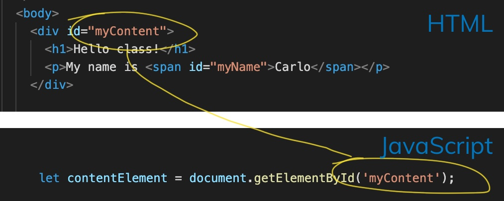

<!-- .slide: id="lesson14" -->

# Basic Frontend - Fall 2020

Lesson 14, Tuesday, 2020-10-13

---

Lesson overview:

- functions recap
  - how to call a function by clicking a button
- introduction to the DOM API
- interacting with HTML elements through the DOM API
- changing colors and content through JavaScript

---

### Recap: Functions

1. What are functions?
1. Why do we need functions?
1. What are functions useful for?

---

### Recap: Functions

- a function is a reusable block of code
- a function allows us to group together several lines of code that we can
  easily run just by executing the function
- functions are handy and convenient
- functions let us structure our code better and let us avoid repetitions 

---

### Recap: Functions


 <!-- .element width="500px" style="display: block; margin: 0 auto;" -->

---

### Recap: functions

To use a function:

1. first we need to create, define, a function
  - function keyword
  - function name
  - parantheses (), and optional parameters
  - function body inside {} with optional return statement
1. then, call the function
 - function name
 - parantheses

---

### Recap: Functions

```js
let numbers = [1, 2, 3];
let numbersSum = 0;

for (let i = 0; i < numbers.length; i++) {
  numbersSum += numbers[i];
}
console.log(numbersSum);

let moreNumbers = [3, 4, 5];
let moreNumbersSum = 0;

for (let i = 0; i < moreNumbers.length; i++) {
  moreNumbersSum += moreNumbers[i];
}
console.log(moreNumbersSum);
```

---

### Recap: Functions

```js
function sum(numbers) {
  let result = 0;
  for (let i = 0; i < numbers.length; i++) {
    result += numbers[i];
  }

  return result;
}

console.log(sum([1, 2, 3]));
console.log(sum([3, 4, 5]));
```

---

### Recap: Functions

We can also connect a function to an HTML element

```html
<button onclick="scream()">Click me!</button>
```

```js
function scream() {
  console.log('AAAAAAAAAAAHHHHHHHHHHH');
}
```

---

<!-- .slide: id="lesson14:DOM" -->

### Static vs dynamic pages

Let's start with this small HTML document

```html
<!DOCTYPE html>
<html>
  <head>
    <title>Lesson 14</title>
  </head>
  <body>
    <h1>Hello class</h1>
    <p>My name is <span id="myName">Carlo</span>, and I wish this page was more interesting</p>
  </body>
</html>
```

---

### Static vs dynamic pages

Once I open this document in the browser, we see this simple, yet beautiful, page.

What can we do with it?

 <!-- .element width="500px" style="display: block; margin: 0 auto;" -->

Well, not much. Nothing, actually.
<!-- .element: class="fragment"  -->

---

### Static vs dynamic pages

- HTML documents are static by nature
- using CSS, we can change their appearance and make them (hopefully) prettier
- we can even animate them, to a certain extent
- but our possibilities of interaction are very limited

---

### Static vs dynamic pages

After the page is loaded in the browser:

1. can we change the background color?
1. can we change the color of the text?
1. can we replace one word with another?
1. can we replace a whole paragraph of text with another one?
1. can we add new content to the page? New words, links, images etc.?


---

### Static vs dynamic pages

The answer is "kind of", but mostly "no".

- with some basic CSS knowledge, we can change some colors when hovering on
  certain elements
<!-- .element: class="fragment"  -->
- with some CSS trickery we could also hide a word and show another one
<!-- .element: class="fragment"  -->
- we can't definitely add new content to the page
<!-- .element: class="fragment"  -->

And also, in the first two cases, we are just changing colors that we decided in
advance
<!-- .element: class="fragment"  -->

---

### Static vs dynamic pages

That's where JavaScript comes into play

With JavaScript we have full control over the pages we create.

We can make our pages dynamic.

---

### Static vs dynamic pages

Some of the things we can do with JavaSript

- change (not just hiding or moving around) the content of a page
- add new content to the page
- most of all: JavaScript can react to user actions

---

### The DOM API

- DOM stands for **D**ocument **O**bject **M**odel
- API stands for **A**pplication **P**rogramming **I**nterface

Don't worry, no more acronyms after those two (at least for today).
<!-- .element: class="fragment"  -->

---

### The DOM API: the DOM


 <!-- .element width="600px" style="display: block; margin: 0 auto;" -->

How do we get from simple HTML to a website?

---

### The DOM API: the DOM

 <!-- .element width="500px" style="display: block; margin: 0 auto;" -->

The browser does a lot of things behind the scenes, one of which is reading
(parsing) the HTML code and transforming it into a "tree" of objects.

---

### The DOM API: the DOM tree

 <!-- .element width="400px" style="display: block; margin: 0 auto;" -->

So, the DOM is just another way of representing an HTML document.

- you can think of it as a tree (an upside-down one)
- the HTML element is its root, on top
- its descendants, the leaves, are the other HTML elements (h1, div, section, p, img etc.)

---

### The DOM API: the DOM tree

Everything inside the DOM is an object, so having an HTML document represented
as a list of objects is very convenient if we want to interact with it using
JavaScript.

We do that through the API part of the DOM.
<!-- .element: class="fragment"  -->

---

### The DOM API: interfaces

Let's focus on the I part of API: interface.

Can you think of some examples of interfaces from your daily life?
<!-- .element: class="fragment"  -->

- a keyboard, a numeric keypad, keys in an elevator
<!-- .element: class="fragment"  -->
- controls (play, stop, pause, back, forward) on a stereo, an iPod, Spotify
<!-- .element: class="fragment"  -->
- controls on a washing machine or a dishwasher
<!-- .element: class="fragment"  -->
- shower mixer (to regulate water temperature) 
<!-- .element: class="fragment"  -->
- car steering wheel
<!-- .element: class="fragment"  -->
- even a waiter in a restaurant
<!-- .element: class="fragment"  -->

---

### The DOM API: interfaces

 <!-- .element width="500px" style="display: block; margin: 0 auto;" -->

---

### The DOM API: interfaces

An interface can be defined in many ways:

 <!-- .element width="800px" style="display: block; margin: 0 auto;" -->

---

### The DOM API: interfaces

Don't worry too much about the precise definition, the main takeaways are:

- an interface allows communication between to subjects
<!-- .element: class="fragment"  -->
- an interface hides complexities
<!-- .element: class="fragment"  -->

In our case, the two subjects are our JavaScript code and the web page we want
to interact with. The complexities are all the work the browser does behind the
scene
<!-- .element: class="fragment"  -->

---

### The DOM API: interfaces

Remember the page I had at the beginning?


 <!-- .element width="500px" style="display: block; margin: 0 auto;" -->

Let's enhance it!

---

### The DOM API in practice 

Interacting with an element on a web page is normally a 2-step process.

Let's take as an example changing the background of a div. The two steps involved
are:

1. getting access to the div element
1. changing one of its properties, specifically the `backgroundColor`


---

### The DOM API in practice: getting access to an element

Every operation in the DOM goes through the `document` object. And for now we
need only one function:

```js
document.getElementById();
```
 <!-- .element width="500px" style="display: block; margin: 0 auto;" -->

---

### The DOM API in practice: getting access to an element

So, let's try it out:

```js
let contentElement = document.getElementById('myContent');
console.log(contentElement);
```

Well, it's an object! A special one, but still an object.
<!-- .element: class="fragment"  -->

---

### The DOM API in practice: getting access to an element

Since it's an object, we can use it like we use other objects.

Let's focus on the property we need: the style property.

```js
let contentElement = document.getElementById('myContent');
contentElement.style.backgroundColor = "red";
```


---

### The DOM API in practice: the style property

The style property is a nested object and contains every CSS property you normally use in a stylesheet.

The difference is that in the DOM API the names are slightly different:

- background-color -> backgroundColor
- font-family -> fontFamily
- border-color -> borderColor
- color -> color

---

### The DOM API in practice: the style property

We can use the style property to get to the backgroundColor and change it:

```js
let contentElement = document.getElementById('myContent');
contentElement.style.backgroundColor = 'red';
```

---

### The DOM API in practice: the style property

Give it a try:

1. create a div with the id myDiv
1. write something in it
1. in JavaScript, get access to the div
1. change its color

---

### The DOM API in practice: the style property

We can do the same with the body element of the page.

```js
document.body.style.backgroundColor = 'green';
```

The "body" is already part of the document object, so we can access it directly
without needing an id.
<!-- .element: class="fragment"  -->

---

### The DOM API in practice: reading element attributes

This is nice, but still not really dynamic.

The goal was to get the color from an input field in our page.

Let's see how we can do that.

---

### The DOM API in practice: element attributes

In my HTML I have this input:
```html
<input type="text" id="pageBackgroundInput" value="red">
```

We can access it in JavaScript:

```js
// get a reference to the input element
let inputElement = document.getElementById('pageBackgroundInput');
// read its "value" attribute
let newColor = inputElement.value;
console.log(newColor); // outputs "red"
// set the body "backgroundColor" equal to "newColor"
document.body.style.backgroundColor = newColor;
```

---

### The DOM API in practice: changing color onclick 

Let's put all of that into a function

```js
function changePageBackground() {
  // get a reference to the input element
  let inputElement = document.getElementById('pageBackgroundInput');
  // read its "value" attribute
  let newColor = inputElement.value;
  console.log(newColor); // outputs "red"
  // set the body "backgroundColor" equal to "newColor"
  document.body.style.backgroundColor = newColor;
}
```

How can we call this function when clicking a button?

---

### The DOM API in practice: changing color onclick 

How can you connect a function to an HTML button?

```html
<input type="text" id="pageBackgroundInput" />
<button onclick="changePageBackground()">Change</button>
```
<!-- .element: class="fragment"  -->

---

### The DOM API in practice: recap

1. we use document.getElementById() to access HTML elements through their ids
1. we can access the HTML body directly using document.body
1. the style object contains all the CSS properties

How can we change the text content inside HTML elements?
<!-- .element: class="fragment"  -->

---

### The DOM API in practice: recap

```html
<p>My name is <span id="myName">Carlo</span></p>
```

Instead of changing style, we change the textContent property
```js
let inputElement = document.getElementById("myNameInput");
let nameElement = document.getElementById("myName");
let newName = inputElement.value;
nameElement.textContent = newName;
```

---
